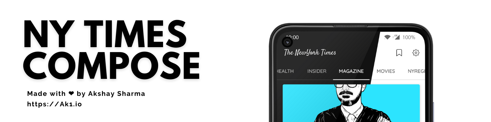
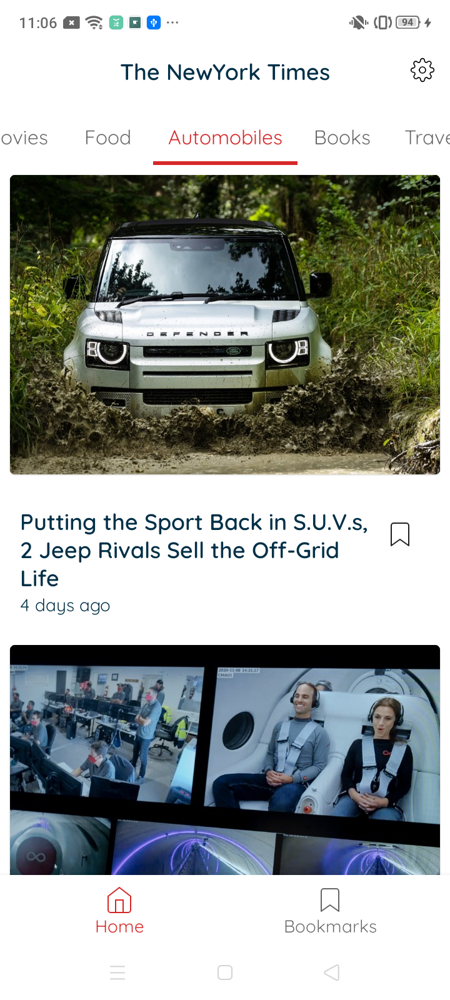
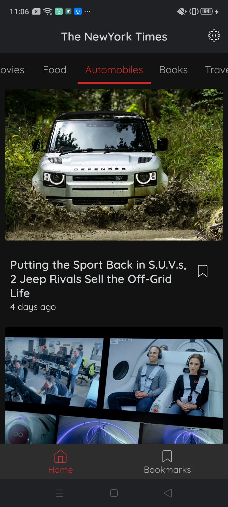
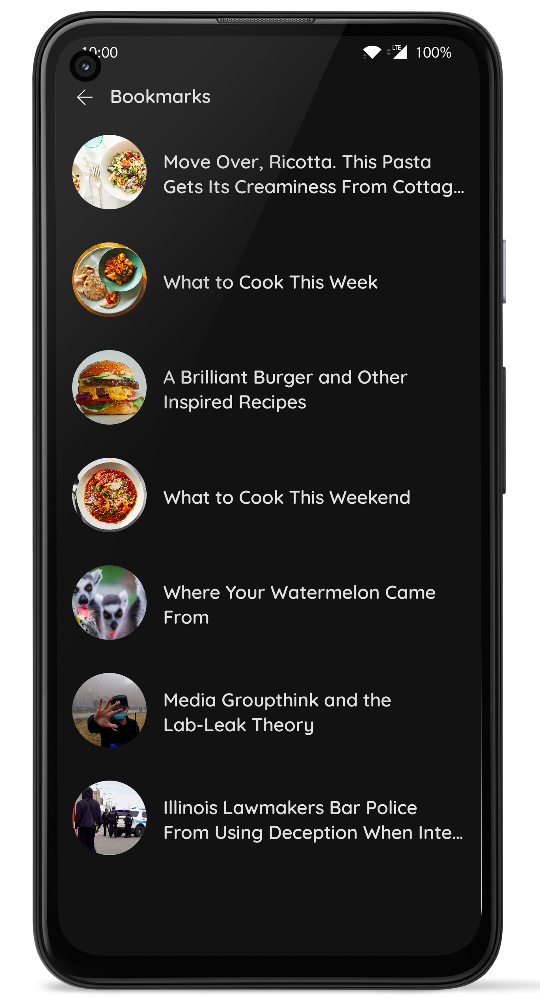
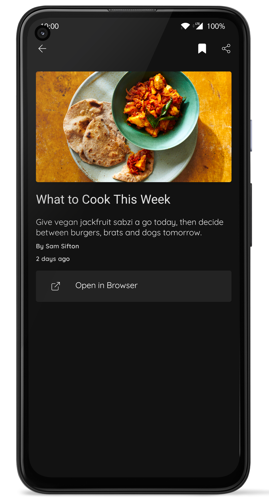

# The NewYork Times App

An offline first application in [Jetpack Compose](https://developer.android.com/jetpack/compose) with [MVVM architecture](https://developer.android.com/jetpack/guide), representing a minimalistic implementation of [Top Stories API](https://developer.nytimes.com/docs/top-stories-product/1/overview). 
Built with components like DataStore, Coroutines, ViewModel, LiveData, Room, Navigation-Compose, Coil-Accompanist etc.

This sample showcases:

* UI state management
* Basic Material Design theming (Light & Dark)
* Offline First Functionality
* Integration with Architecture Components: Navigation, ViewModel, Room
* Minor features like Pull-to-refresh, dedicated settings screen, Time-bounded refresh, Dialogs etc.


Getting Started
---------------
To try out this sample app, you need to use the latest
[Canary version of Android Studio](https://developer.android.com/studio/preview).

This project uses the Gradle build system. To build this project, use the
`gradlew build` command or use "Import Project" in Android Studio.

For more resources on learning Android development, visit the
[Developer Guides](https://developer.android.com/guide/) at
[developer.android.com](https://developer.android.com).

### New York Times API key

NY Times-Compose  uses the [Top Stories API](https://developer.nytimes.com/docs/top-stories-product/1/overview) from [New York Times](https://developer.nytimes.com/) to load stories on home screen. To use the API, you will need to obtain a free developer API key. See the
[New York Times API Documentation](https://developer.nytimes.com/get-started) for instructions.

Once you obtain the api key create a file *apikey.properties* in the root folder and add this line

```
API_KEY=<your api key>
```

Screenshots
-----------


Upcoming features
-----------------
Updates will include incorporating additional Jetpack components and updating existing components
as the component libraries evolve.

Interested in seeing a particular feature of the Android Framework or Jetpack implemented in this
app? 
Please open a new [issue](https://github.com/akshay2211/NYTimes-Compose/issues).

License
-----------------
Licensed under the Apache License, Version 2.0, [click here for the full license](/LICENSE).

Author & support
-----------------
This project was created by [Akshay Sharma](https://akshay2211.github.io/).

If this project help you reduce time to develop, you can give me a cup of coffee :) 

[](https://www.paypal.me/akshay2211)


